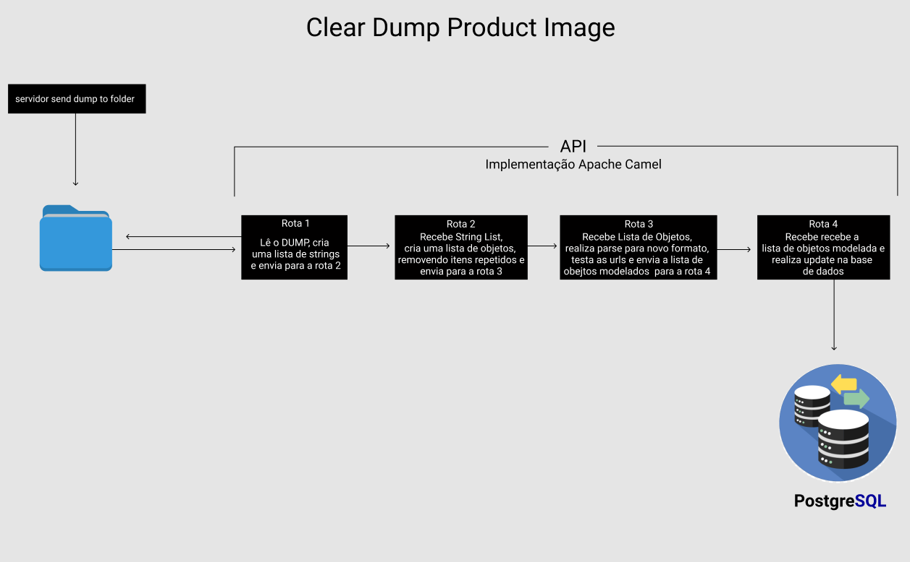

# Post Product
Esté serviço foi criado para solucionar o seguinte problema: 
Recebemos um dump com lista de URLs de imagens de produtos que vamos utilizar para manter nossa base de dados atualizada. Este dump contém imagens de milhões de produtos e URLs, e é atualizado a cada 10 minutos, a baixo um exemplo do conteúdo do arquivo: 

```json
{"productId": "pid2", "image": "http://localhost:4567/images/6.png"}
{"productId": "pid1", "image": "http://localhost:4567/images/1.png"}
{"productId": "pid1", "image": "http://localhost:4567/images/2.png"}
{"productId": "pid1", "image": "http://localhost:4567/images/7.png"}
{"productId": "pid1", "image": "http://localhost:4567/images/3.png"}
{"productId": "pid1", "image": "http://localhost:4567/images/1.png"}
{"productId": "pid2", "image": "http://localhost:4567/images/5.png"}
{"productId": "pid2", "image": "http://localhost:4567/images/4.png"}
```
As URLs pertencem a uma empresa terceirizada que hospeda a maioria destas imagens, e ela nos cobra um valor fixo por cada request.
Já sabemos que o dump de origem não tem uma boa confiabilidade, pois encontramos várias imagens repetidas e boa parte delas também retornam status 404.
Como não é interessante atualizar nossa base com dados ruins, filtramos apenas as URLs que retornam status 200.

O processo de atualização deve receber como input um dump sanitizado, onde o formato é ligeiramente diferente da entrada:

```json
{"productId": "pid1", "images": ["http://localhost:4567/images/1.png", "http://localhost:4567/images/2.png", "http://localhost:4567/images/7.png"]}
{"productId": "pid2", "images": ["http://localhost:4567/images/3.png", "http://localhost:4567/images/5.png", "http://localhost:4567/images/6.png"]}
```

Para diminuir a quantidade de requests necessárias para validar as URLs, decidimos limitar a quantidade de imagens por produto em até 3.

O objetivo é gerar o dump final no menor tempo possível e com a menor quantidade de request já que cada um ira gerar um custo para a empresa. 




## Executando e testando o projeto

### Pré-requisitos
* Java 8
* Maven
* Estar com a API "ImageRequest" rodando
### Passo a passo


#### 1 - Subir a API "ImageRequest"
`Faça o download da API no link: https://github.com/infortic/ImageRequest`

`1.A - ` Dentro do diretório root da aplicação execute:

`$ mvn clean install`   --  Para buildar a aplicação


`1.B - ` Agora acesse a diretorio `target/` criado no passo anterior e execute:

`$ java -jar ImageRequest-0.0.1.jar`

#isso fará com que a aplicação esteja respondendo a requicicopes do tipo GET no seguinte padrão de url: 

`http://localhost:4567/images/{6.png}`


#### 2 - Executando testes automatizados:

Para rodar os testes automatizados basta executar:

`$ mvn test 


#### 3 - Buildando a aplicação:

Para gerar o pacote da aplicação:`

`$ mvn clean install 

O Maven através do `spring-boot-maven-plugin` gerou o jar executável do projeto quando executamos o passo 3.
Então basta entrar no diretório `target/` que esta no diretório root e executar:

`$ java -jar processClearDump-0.0.1.jar`

A partir deste ponto se tudo ocorrer corretamente a aplicação estará rodando e a cada 10 minutos ela busca um novo dump na pasta "mainFile" no direitorio principal da aplicação

### OBS: O caminho desta pasta pode ser auterado facilmente na rota 1.